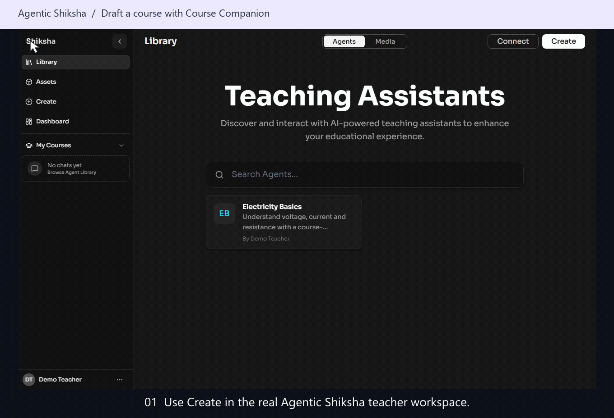
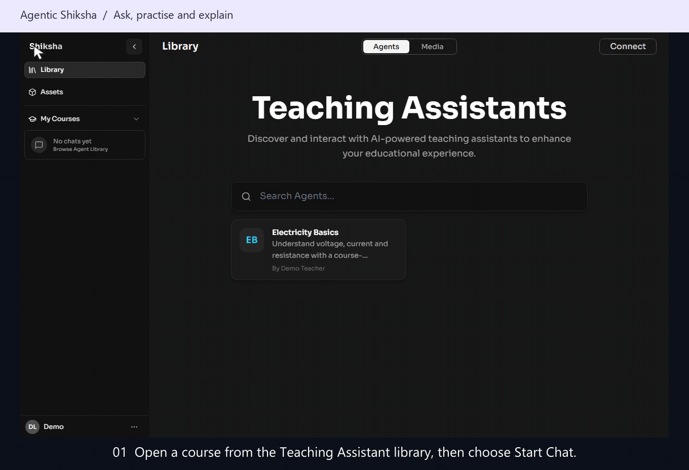
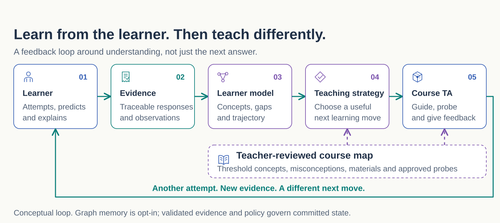
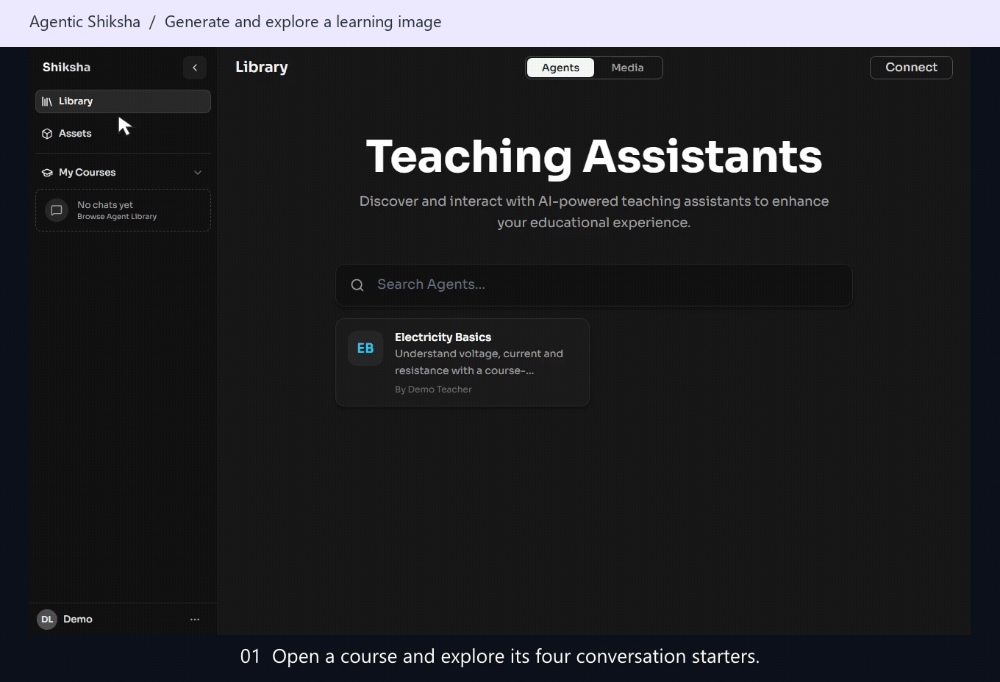
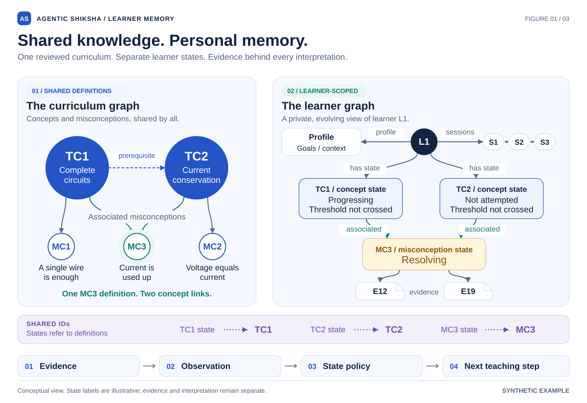
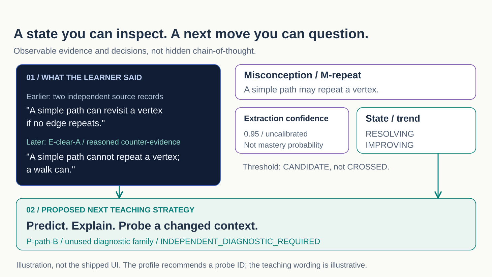

<a href="../docs/pedagogy/ekalaiva.md">
  
</a>


# Welcome to Agentic Shiksha!

<p>
  <a href="#getting-started"></a>
  <a href="#demos"></a>
  <a href="../docs/README.md"></a>
  <a href="../docs/architecture.md"></a>
  <a href="../docs/pedagogy/ekalaiva.md"></a>
</p>

**Agentic Shiksha helps teachers build AI teaching assistants for their courses.**
Teachers shape the course and review the teaching approach. The agents use course
concepts, common misconceptions, and evidence from learner interactions to guide
what to ask, explain, or practise next.

The project draws on [Project Ekalaiva](../docs/pedagogy/ekalaiva.md) and a central
research question: **What changed in the learner’s understanding?**

## Background

**Shiksha** is a Sanskrit word associated with *instruction, learning, and
education* ([Wikipedia](https://en.wikipedia.org/wiki/Shiksha)). At its core,
education is not only about access to information, but about helping learners
build understanding, overcome difficult ideas, and develop the ability to think
and apply knowledge independently.

AI has gradually evolved from systems that primarily generated responses into
**[agents](https://www.anthropic.com/engineering/building-effective-agents)** that
can reason over context, use tools, maintain state, plan across multiple steps,
and work toward goals. This evolution creates an opportunity to rethink how AI
can participate in education, not merely as a question answering interface, but
as a system that can observe, adapt, and support learning over time.

**[EKALAIVA](../docs/pedagogy/ekalaiva.md)** provides the pedagogical foundation
for this direction. It emphasizes ideas such as
[threshold concepts](../docs/pedagogy/ekalaiva.md#threshold-concepts),
[challenge driven learning][background-ekalaiva-challenges],
[portfolio based assessment][background-ekalaiva-portfolios],
[flexible learning pathways][background-ekalaiva-overview],
[lifelong learning][background-ekalaiva-lifelong], and a
[changing role for faculty][background-ekalaiva-faculty]. A central idea is that
learning should focus not just on delivering more content, but on helping
learners cross the conceptual barriers that fundamentally change how they
understand a subject.

**Agentic Shiksha** emerges from bringing these two ideas together: agentic AI
and the [EKALAIVA pedagogy](../docs/pedagogy/ekalaiva.md#how-agentic-shiksha-relates-to-the-vision).
It explores [course specific teaching agents](../docs/agents/course-ta.md) that
work with [teacher intent](../docs/agents/course-creation.md#inputs-and-outputs),
[course knowledge](../docs/agent-dataflow.md#course-material-processing),
[learner interactions, misconceptions, and progress](../docs/memory/overview.md#from-an-interaction-to-usable-memory)
to determine what support may be useful next, shifting AI in education from
simply *answering questions* toward *supporting the learning process itself*.

[background-ekalaiva-overview]: https://medium.com/@swamimanohar_73269/project-ekalaiva-the-six-pillars-of-educational-transformation-9e7c022b2964
[background-ekalaiva-challenges]: https://medium.com/@swamimanohar_73269/grand-challenge-driven-unified-pedagogy-learning-through-problems-that-matter-5362616101b7
[background-ekalaiva-portfolios]: https://medium.com/@swamimanohar_73269/portfolio-based-assessment-from-proof-of-reproduction-to-proof-of-application-9d1125b3ef55
[background-ekalaiva-lifelong]: https://medium.com/@swamimanohar_73269/ekalaivas-fifth-pillar-breaking-the-linear-prison-of-education-lifelong-learning-and-lifelong-38df2bb8cbec
[background-ekalaiva-faculty]: https://medium.com/@swamimanohar_73269/faculty-transformation-from-gatekeepers-to-guides-in-the-ai-age-10761c31249a

## The teaching approach

A correct answer is useful evidence, but it does not tell the whole story. A
learner might remember a procedure without understanding why it works, or explain
an idea well but struggle to apply it in a different setting.

Agentic Shiksha is designed around four ideas:

- **Teachers shape the course.** Course creation includes teacher review of the
  concepts, troublesome ideas, and teaching instructions that guide the assistant.
- **Teach for understanding.** Threshold concepts—the ideas that change how a
  learner understands a subject—give the teaching a direction beyond topic coverage.
- **Use evidence to adapt.** Learner responses and unresolved misconceptions
  inform the next question, explanation, or activity.
- **Follow learning over time.** Learner memory connects observations across
  sessions so progress and persistent gaps can be examined.

This explores the course-level teaching part of Ekalaiva’s broader vision for
education. Read the [pedagogy guide](../docs/pedagogy/ekalaiva.md) for the framework,
its relationship to the implementation, and Swami Manohar’s original essays.

## Demos

Two short walkthroughs show the teacher and learner experiences. The previews
below are animated GIFs, which render directly in GitHub READMEs.

| Build a course assistant | Learn with a course assistant |
| --- | --- |
|  |  |
| Course Companion proposes changes for the teacher to review. | A learner attempts a concept check and receives feedback. |
| [Download MP4 · 32 seconds](../assets/web/motion/shiksha-course-setup-tutorial.mp4?raw=1) · [Still preview](../assets/images/motion/shiksha-course-setup-tutorial.png) · [Captions](../assets/web/motion/shiksha-course-setup-tutorial.vtt) | [Download MP4 · 37 seconds](../assets/web/motion/shiksha-chat-tutorial.mp4?raw=1) · [Still preview](../assets/images/motion/shiksha-chat-tutorial.png) · [Captions](../assets/web/motion/shiksha-chat-tutorial.vtt) |

**For play/pause, seeking, and captions:** download an MP4 and open it in your
video player, or open [the demo gallery](../assets/web/motion/index.html) from
a local checkout. GitHub displays repository HTML as source and does not turn a
relative MP4 link into an inline player. Native GitHub video embeds require an
uploaded video attachment; the GIF previews work without a separate upload.

These recordings use the actual UI with synthetic data and intercepted responses.
They do not connect to live cloud agents; the teacher walkthrough stops before
creating an assistant. See [how the demos were made](../assets/images/README.md).

## How it works

The teacher-reviewed course map grounds a feedback loop: the learner’s work
provides evidence, that evidence informs the learner model, and the teaching
assistant uses it to choose the next learning step.

[](../docs/architecture.md)

The platform brings together course creation, course teaching assistants, learner
memory, teacher insights, and a separate administration dashboard. The learner
model and teaching strategy in the diagram describe responsibilities; they are
not separate agents.

[Agent catalogue](../docs/agents/README.md) ·
[Agent and data flow](../docs/agent-dataflow.md) ·
[Workflow coverage audit](../docs/workflows/README.md) ·
[Architecture atlas](../assets/web/architecture/index.html) ·
[Deployment guide](../docs/deployment.md)

## Image generation

Ask a course TA to turn a lesson into a labeled illustration, open the image for
a closer look, and ask a follow-up in the same conversation. Image generation
uses the TA's `generate_image` tool; it is not a separate teaching agent.



[Download MP4 - 35 seconds](../assets/web/motion/shiksha-image-generation-tutorial.mp4?raw=1) ·
[Still preview](../assets/images/motion/shiksha-image-generation-tutorial.png) ·
[Captions](../assets/web/motion/shiksha-image-generation-tutorial.vtt) ·
[Feature guide and example prompts](../docs/image-generation.md)

The recording uses the real interface with four starters and collapsed
navigation when viewing the image. Its artwork and responses are synthetic,
not live image-model output or a speed benchmark. Live use requires a configured
image deployment, storage and an available course tool. Always review generated
labels and relationships against the course material.

## Learner memory

Memory serves two purposes:

| Part | Purpose |
| --- | --- |
| **Memory Store** | Recall relevant information from conversations. |
| **Learner-memory structure** | Connect concepts, misconceptions, evidence, and changes in understanding over time. |

<a href="../docs/memory/overview.md">
  <picture>
    <source media="(prefers-color-scheme: dark)" srcset="../assets/images/memory/01-connected-memory-graphs-dark.svg">
    
  </picture>
</a>

*Illustration of the custom learner-memory structure, not the hosted Memory Store.*
[Full-size SVG](../assets/images/memory/01-connected-memory-graphs.svg) ·
[High-resolution PNG](../assets/images/memory/01-connected-memory-graphs.png) ·
[All three views and reuse options](../assets/images/memory/README.md)

The learner-memory design keeps observations, inferred misconceptions, and
learning state distinct. Evidence and its source remain available for inspection;
model confidence alone does not establish mastery.

**Graph memory is optional and off by default.** See the
[memory guide](../docs/memory/README.md) for the mechanism, state rules, and evidence model.

<details>
<summary>Inspect a teaching decision</summary>

The illustrative decision record connects a learner observation to an inferred
misconception, supporting evidence, state and trend, and a proposed teaching move.
It shows the basis for a decision, not hidden chain-of-thought.

[](../docs/memory/see-it-think.md)

This is a synthetic research example. Read the
[walkthrough](../docs/memory/see-it-think.md) for the example and current UI boundaries.

</details>

## Getting started

**Explore the demos:** watch the animated previews above without cloud access.
From a local checkout, open
[assets/web/motion/index.html](../assets/web/motion/index.html) in your browser
for the video gallery.

**Run the application:** follow [INSTALL.md](../INSTALL.md) to configure the backend,
frontend, identity, and required cloud services.

The current application uses **Azure / Microsoft Foundry**. Direct OpenAI, local
models, and other providers require integration work; they are not drop-in
alternatives. The [provider guide](../docs/providers.md) explains the current
dependencies and planned separation of core logic from provider integrations.

For setup problems, start with [installation troubleshooting](../INSTALL.md#troubleshooting)
or [support](../SUPPORT.md). Browser sign-in and backend access to Azure services are
configured separately.

## Research status

Agentic Shiksha is research software. This repository contains source code,
design documentation, software tests, synthetic demonstrations, and an evaluation
protocol. It does not currently link measured learning outcomes or a deployment
report. Production readiness and learning benefits need to be evaluated for the
intended setting.

Evaluation focuses on four questions:

| Area | Question |
| --- | --- |
| Teaching approach | Does the assistant elicit reasoning and follow the intended pedagogy? |
| Learning | Can learners explain, retain, and apply what they learned? |
| Adaptation | Does the next teaching move address the learner’s demonstrated gaps? |
| Reliability | Are claims grounded, and are learner records trustworthy when something fails? |

See the [evaluation methodology](../docs/evaluation.md),
[research and publication status](../docs/research.md), and [changelog](../CHANGELOG.md).
Current engineering priorities include isolating provider dependencies and
separating runtime and workflow code; see the [refactoring plan](../refactoring_plan.md).

## Repository guide

```text
Agentic Shiksha Platform/
  Backend/          Main API, teaching runtime, tools, and learner memory
  Frontend/         Learner app, course builder, and teacher dashboard
Admin-Dashboard/    Institution-wide admin API and UI
docs/              Pedagogy, agents, memory, evaluation, and deployment
assets/
  images/          Diagrams, artwork, and demo previews
  web/             Architecture and demo galleries, videos, and captions
```

[Platform guide](<../Agentic Shiksha Platform/README.md>) ·
[Admin guide](../Admin-Dashboard/README.md) ·
[Documentation index](../docs/README.md)

Visual resources are grouped under [assets](../assets/), with separate
[image assets](../assets/images/README.md) and [web galleries/tools](../assets/web/README.md).
Keep both subfolders together when copying a gallery so its relative media links work.

## Contributing

Contributions from teachers, learners, researchers, and engineers are welcome.
Useful contributions include reviewing diagnostic questions, improving teaching
examples, testing learner-memory behavior, and making setup easier to reproduce.

Start with [CONTRIBUTING.md](../CONTRIBUTING.md) and the
[Code of Conduct](../CODE_OF_CONDUCT.md). For bugs or ideas,
[open an issue](https://github.com/microsoft/Agentic-Shiksha/issues) with enough
detail to reproduce the problem or understand the proposal. Check the
[FAQ](../FAQ.md) and [support guide](../SUPPORT.md) for common questions.

Keep learner records and credentials out of public issues. Report vulnerabilities
through the private [security reporting process](../SECURITY.md#reporting-security-issues).

[Meet the contributors](https://github.com/microsoft/Agentic-Shiksha/graphs/contributors).

<details>
<summary>Before using the platform with learners</summary>

- Review data handling, retention, consent, and service terms for your setting.
  Cloud services and models may have separate licences and usage charges.
- Keep educators involved in reviewing generated explanations, assessments, and
  inferred misconceptions. These can be wrong.
- Configure identity, authorization, content-safety controls, and monitoring for
  your deployment. Never commit secrets; frontend `VITE_` settings are public.

See [deployment guidance](../docs/deployment.md), [security](../SECURITY.md), and the
[privacy and safety limitations](../FAQ.md).

</details>

## Repository automation

| Path | Purpose |
| --- | --- |
| [workflows/](workflows) | GitHub Actions — CI and code scanning. |
| [dependabot.yml](dependabot.yml) | Automated dependency update pull requests. |

Community health files remain at the repository root:
[CONTRIBUTING.md](../CONTRIBUTING.md), [CODE_OF_CONDUCT.md](../CODE_OF_CONDUCT.md),
[SECURITY.md](../SECURITY.md), [SUPPORT.md](../SUPPORT.md) and [FAQ.md](../FAQ.md).

Backend-specific assistant instructions are in
[Agentic Shiksha Platform/Backend/.github/](<../Agentic Shiksha Platform/Backend/.github>);
that folder holds no workflows.

## Citation

If you use Agentic Shiksha in your work, cite the software and the commit or
version used. Cite [Swami Manohar’s Ekalaiva essays](../docs/pedagogy/ekalaiva.md#references-manohars-blog-series)
separately when discussing the underlying framework.

<details>
<summary>Software BibTeX</summary>

```bibtex
@misc{agentic_shiksha,
  author       = {{Agentic Shiksha contributors}},
  title        = {Agentic Shiksha},
  year         = {2026},
  howpublished = {\url{https://github.com/microsoft/Agentic-Shiksha}},
  note         = {Research software. Specify the commit or version used.}
}
```

</details>

## License

[MIT](../LICENSE). See the [media guide](../assets/images/README.md) for information about
the original figures and synthetic demos.

<details>
<summary>Trademarks</summary>

This project may contain trademarks or logos for projects, products, or services.
Authorized use of Microsoft trademarks or logos is subject to and must follow
[Microsoft's Trademark & Brand Guidelines](https://www.microsoft.com/legal/intellectualproperty/trademarks/usage/general).
Use of Microsoft trademarks or logos in modified versions of this project must not cause
confusion or imply Microsoft sponsorship. Any use of third-party trademarks or logos is
subject to those third parties' policies.

</details>
