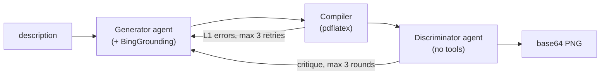

# add_tikz_diagram

Generates educational diagrams through a generator–discriminator pipeline built
on Azure AI Agents. The teaching agent calls it like any other tool and receives
a base64 PNG back.

| | |
|---|---|
| Class | `AddTikzDiagramTool` |
| Tool name | `add_tikz_diagram` |
| Schema | [definition.json](definition.json) |
| Frontend event | `tikz_image` |

## Pipeline

1. **Generator** (+ `BingGroundingAgentTool`): description → TikZ code. Bing
   access lets it look up LaTeX packages and diagram conventions.
2. **Compiler** (`pdflatex`): TikZ → PNG, feeding L1 errors back on failure
   (max 3 retries).
3. **Discriminator** (no tools): PNG + code + description → pass/fail + critique.
4. **Feedback loop**: critique → generator rewrites (max 3 rounds).

Both agents are real Azure AI Agents created via `agents.create_version()` with
named agent references.

## Result payload

Returns `type`, `title`, `imageData`, `caption`, and
`visualizationType: "tikz_agent"`. Two failure paths return the same shape with
**`error: True`** — a missing `description`, and any exception from the pipeline.

## Configuration

Read from the environment at import time: `PROJECT_ENDPOINT`,
`TIKZ_GENERATOR_MODEL`, `TIKZ_DISCRIMINATOR_MODEL`, `TIKZ_POLISHER_MODEL`,
`AZURE_BING_CONNECTION_ID`.

## Notes

This is by far the heaviest tool — importing it pulls in `openai` and
`azure.ai.projects`, which together dominate the package's import cost. Because
`agent_tools/custom/__init__.py` imports every tool eagerly, that cost is paid
even when only another tool is needed.

Being a multi-round LLM pipeline, `execute` is also slow relative to the other
tools, and the `output` failure message tells the model to describe the diagram
verbally rather than retry.
