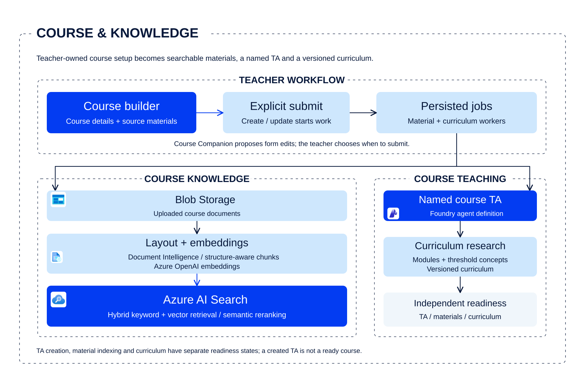
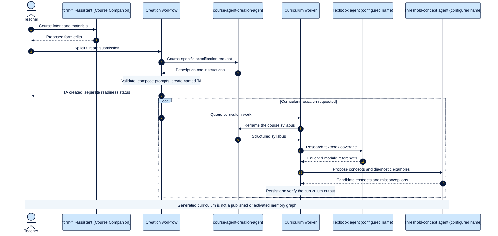
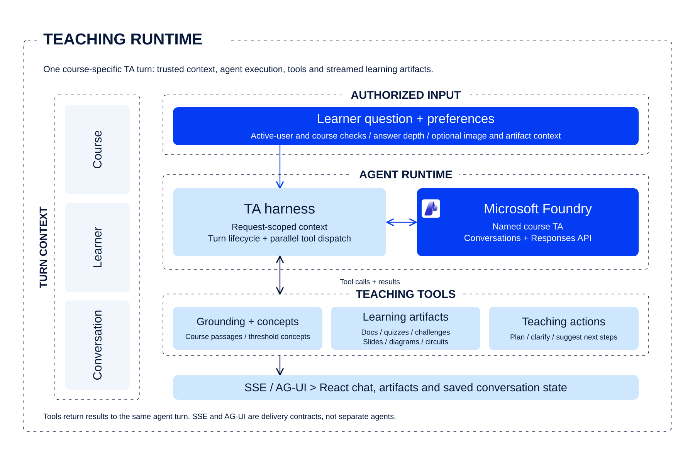
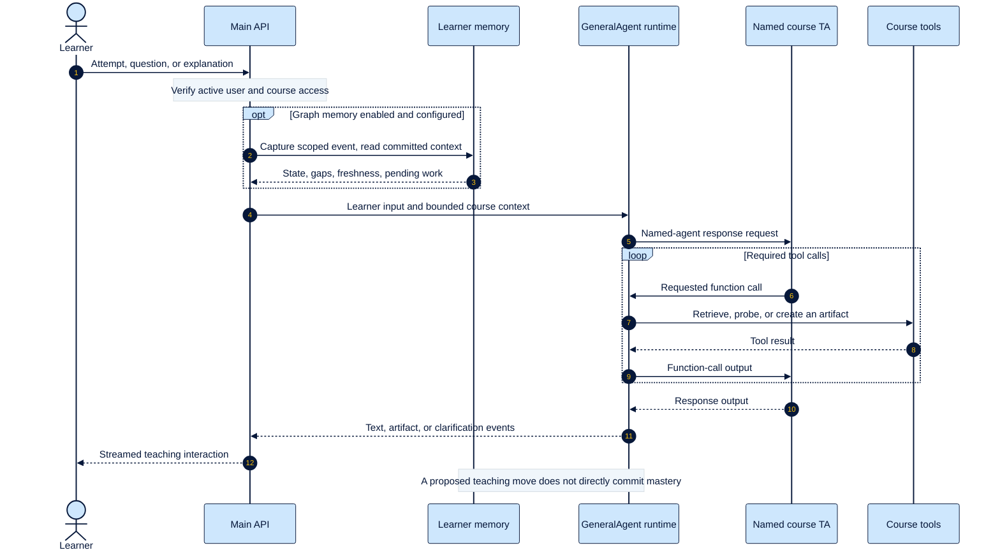
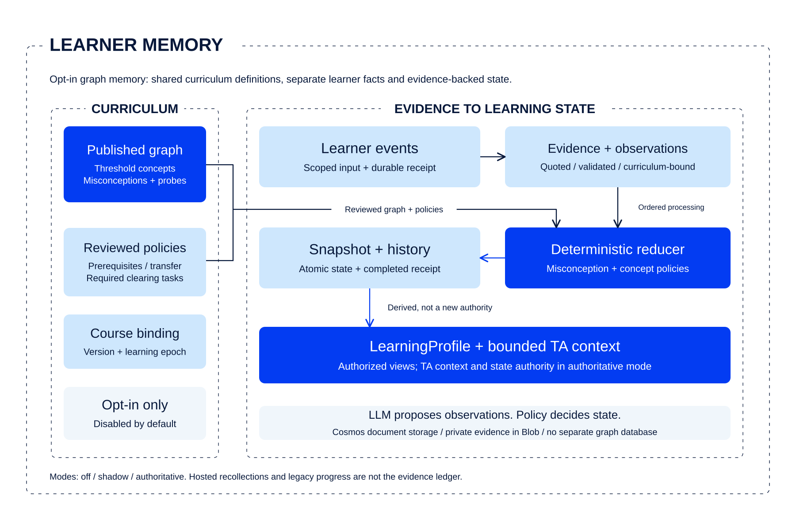
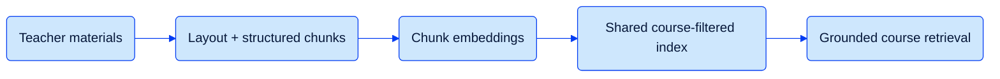

# Agents and dataflow

[Conceptual architecture](architecture.md) / [Workflow coverage](workflows/README.md) /
[Documentation](README.md) / [Deployment](deployment.md)

**Source snapshot: 2026-09-30; Unreleased.** Agent hand-offs and data processing
are different views of the system. Neither diagram below asserts a live rollout.

## Agent interactions

### A teacher creates a course agent

Course Companion proposes a draft; the teacher submits it. Specification,
materials, and curriculum have distinct completion states.

Detailed creation hand-offs

The [creation guide](agents/course-creation.md) follows
`course-agent-creation-agent`; [curriculum research](agents/curriculum-research.md)
follows the textbook and threshold-concept agent calls. Creation and curriculum
workers are local orchestration, not extra agents. The [agent catalogue](agents/README.md)
also distinguishes Course Companion, CCA builder compatibility, teacher Insights
and admin analytics. This is not a claim that the project uses AutoGen.

### A learner takes the next step

The same course TA uses local tools and scoped context. Transport adapters are
not additional teaching agents.

Detailed learner-turn hand-offs

This depicts the canonical streaming/tool path. The
[course TA guide](agents/course-ta.md#execution-sequence-and-ownership)
documents the older non-streaming path and its differences. Graph processing is
asynchronous: an accepted event is not a completed state update.

### Teacher and administrator insights

The embedded teacher dashboard calls the main API's
`/api/teacher-dashboard/logging-agent/chat/stream`, whose agent reference is
configured by **`TEACHER_ANALYTICS_AGENT_NAME`**, with no built-in name default.
The server supplies the authorized course/student
scope to its tools.

The standalone Admin Dashboard uses its own
`/api/dashboard/logging-agent/chat/stream` endpoint and the agent configured by
**`LOGGING_AGENT_NAME`**. Institute/department research in that service uses
**`INSTITUTE_RESEARCH_AGENT_NAME`**. These are distinct integrations, not
alternate names for the learner's course TA. See the
[source-backed agent catalogue](agents/README.md).

## Evidence processing

Keep source evidence, model interpretation, and policy decisions separate.
This processing-pipeline view explains the opt-in graph path, not legacy progress.

```mermaid
%%{init: {"theme":"base","themeVariables":{"primaryColor":"#CEE7FD","primaryTextColor":"#07183A","primaryBorderColor":"#07183A","secondaryColor":"#F0F6FB","tertiaryColor":"#FFFFFF","lineColor":"#033CF2","textColor":"#07183A"}}}%%
flowchart LR
    subgraph Source["Record"]
        Event("Learner event") --> Receipt("Durable receipt")
        Receipt --> Evidence("Source evidence")
    end
    subgraph Interpretation["Interpret"]
        Observations("LLM observations") --> Validate("Validation gate")
    end
    subgraph Decision["Decide and publish"]
        Policy("Deterministic policy") --> Snapshot("Atomic snapshot + history")
    end
    Evidence --> Observations
    Validate -->|accepted| Policy
    classDef source fill:#F0F6FB,stroke:#019BFA,color:#07183A
    classDef model fill:#CEE7FD,stroke:#033CF2,color:#07183A
    classDef state fill:#22F1EC,stroke:#02B3C3,color:#07183A
    class Event,Receipt,Evidence source
    class Observations,Validate model
    class Policy,Snapshot state
```

Record, interpretation and publication detail

Rejected or pending work leaves the last complete snapshot intact. The derived
learning profile supplies bounded context and a next-probe suggestion; it is not
another authority. `shadow` still writes evidence/state, while legacy progress
retains authority. Read the [evidence contract](memory/evidence-model.md) and
[state policy](memory/misconception-state.md).

Full source-grounded evidence lifecycle

The [detailed research reference](../assets/images/research/02-evidence-lifecycle.svg)
provides an expanded offline-review and online-processing view.

Publication and course activation are separate operations. Process and worker
flags both default to off. This expanded figure belongs in the docs, not in the
README's conceptual architecture.

## Course-material processing

Course grounding is a retrieval pipeline, not a learner-mastery signal.

See the [Agentic Shiksha course-knowledge view](../assets/web/architecture/index.html#04-shiksha-course-knowledge)
above for the surrounding workflow.

Retrieval-stage detail

The [common-index implementation](<../Agentic Shiksha Platform/Backend/azure_services/tools/search/course_index_manager.py>)
uses Azure AI Search, Document Intelligence Layout, and embedding skills.
[Retrieval](<../Agentic Shiksha Platform/Backend/utils/course_materials.py>) applies
course/material-session scope. This is not GraphRAG; the diagram borrows the
clear processing-stage convention, not a claim of framework adoption.

## Source map

| Responsibility | Implementation |
| --- | --- |
| Explicit submission and resumable creation | [Course creation](<../Agentic Shiksha Platform/Backend/utils/course_creation.py>) |
| Material and curriculum worker lifetime | [Material routes](<../Agentic Shiksha Platform/Backend/backend/routers/course_materials.py>) |
| Named TA, tool dispatch, internal events | [Canonical harness](<../Agentic Shiksha Platform/Backend/harness/README.md>) |
| Validated evidence and atomic state publication | [Memory processor](<../Agentic Shiksha Platform/Backend/learner_memory/processor.py>) |
| Four services and managed dependencies | [Engineering/deployment guide](deployment.md) |

The role-oriented diagrams use the conversational clarity of AutoGen-style
figures; the stage-oriented diagrams use a processing-pipeline convention.
Framework choices and provider support are documented separately in
[provider boundaries](providers.md).
