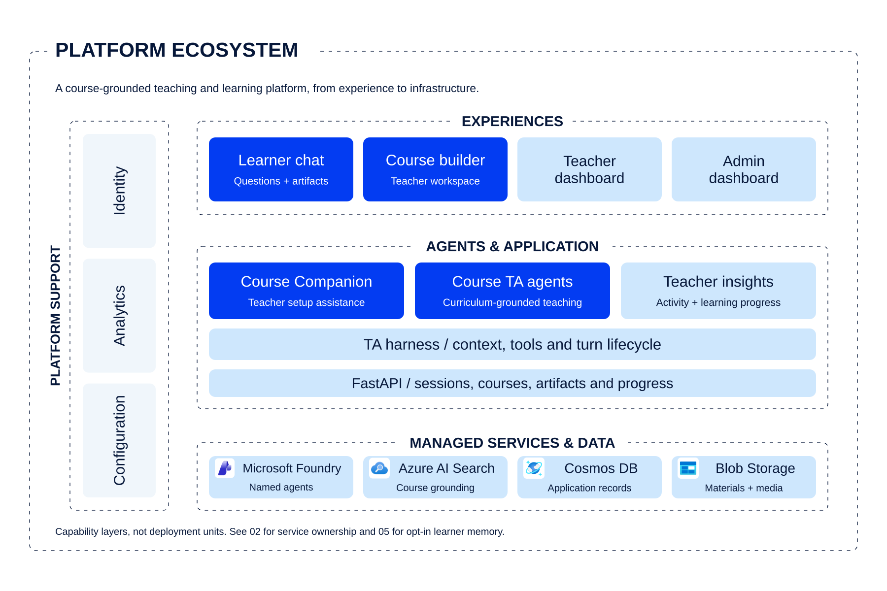

# Architecture

[Documentation index](README.md)

**Source snapshot: 2026-09-30; Unreleased.** This is a map of the current
implementation, not a live Azure inventory or a claim that the
[refactoring plan](../refactoring_plan.md) is complete.

## Agentic Shiksha Architecture Atlas

Use the Atlas for architecture diagrams: flat cards, dashed capability groups,
explicit service names, and colours from the
[Agentic Shiksha logo](../assets/images/architecture/README.md#logo-palette).

[All five views](../assets/web/architecture/index.html) ·
[Service architecture](../assets/web/architecture/index.html#02-shiksha-service-architecture) ·
[Teaching runtime](../assets/web/architecture/index.html#03-shiksha-teaching-runtime) ·
[Course knowledge](../assets/web/architecture/index.html#04-shiksha-course-knowledge) ·
[Learner memory](../assets/web/architecture/index.html#05-shiksha-learner-memory) ·
[SVG + PNG bundle](../assets/web/architecture/shiksha-architecture-set.zip).

## The research idea

**Learner -> Evidence -> Learner Model -> Teaching Strategy -> Course TA -> Learner.**
The next teaching move should respond to evidence of understanding, not just the
last message.

| Component | Question it answers | Read the contract |
| --- | --- | --- |
| Learner | What did the learner try, predict, or explain? | [Learning interaction](agents/course-ta.md) |
| Evidence | Which source supports this observation? | [Evidence model](memory/evidence-model.md) |
| Learner model | What is understood, uncertain, or still troublesome? | [Memory and state](memory/overview.md) |
| Teaching strategy | What learning move should come next? | [EKALAIVA teaching cycle](pedagogy/ekalaiva.md#intended-teaching-cycle) |
| Course Teaching Assistant | How is that move turned into a grounded interaction? | [Course TA runtime](agents/course-ta.md) |
| Reviewed course map | Which concepts, misconceptions, and probes matter? | [Curriculum research](agents/curriculum-research.md) |

These are **six conceptual components, not six services**. The graph-memory
implementation is opt-in and off by default. In its authoritative mode, validated
evidence and deterministic policy govern committed state; model confidence,
generated praise, and legacy `learned` records are not proof of threshold crossing.
The [agent catalogue](agents/README.md) identifies the actual named references;
the learner model, teaching strategy and workers are not additional agents.

## Choose the right view

| View | What belongs there |
| --- | --- |
| [Conceptual architecture](#the-research-idea) | The learning hypothesis and feedback loop |
| [Agent interactions](agent-dataflow.md#agent-interactions) | Teacher, creation, research, and teaching-agent hand-offs |
| [Workflow and dataflow](agent-dataflow.md#evidence-processing) | Evidence intake, interpretation, validation, state, and material processing |
| [Engineering and deployment](deployment.md) | Four services, worker lifetime, stores, access boundaries, and release checks |
| [Provider separation](providers.md) | Implemented dependencies versus a proposed portable boundary |

The research figures are original artwork, not product screenshots or study
evidence. Download the [editable figure](../assets/images/research/04-conceptual-loop.svg)
or [PNG](../assets/images/research/04-conceptual-loop.png) for a talk or research report.

## System boundaries

The repository contains four independently built services. The main backend and
frontend are grouped under `Agentic Shiksha Platform`; that directory is not an
additional service, Python package, or shared container build context.

| Service | Ownership | Runtime entry |
| --- | --- | --- |
| [Main frontend](<../Agentic Shiksha Platform/Frontend/README.md>) | Learner chat, course creation/editing, artifacts, and embedded teacher dashboard | React/Vite; Nginx in its image |
| [Main backend](<../Agentic Shiksha Platform/Backend/README.md>) | Application sessions, course access, TA turns, materials, progress, and teacher APIs | `backend.main:app` |
| [Admin frontend](../Admin-Dashboard/frontend/README.md) | Institution-wide administration and analytics UI | Separate React/Vite build and Nginx image |
| [Admin backend](../Admin-Dashboard/backend/README.md) | Direct analytics/storage queries, research, and optional response evaluation | `main:app`, with service-local flat imports |

See the separate [engineering/system figure](deployment.md) for these services
and their managed dependencies. Infrastructure is deliberately not mixed into
the conceptual feedback loop.

The admin API is not a proxy for the main API. Conversely, the embedded teacher
dashboard uses the main backend's teacher-scoped routes, not the admin backend.
See [admin frontend routing](../Admin-Dashboard/frontend/src/lib/config.ts) and
[teacher routes](<../Agentic Shiksha Platform/Backend/teacher_dashboard/routes.py>).

## Application composition

[backend/app.py](<../Agentic Shiksha Platform/Backend/backend/app.py>) assembles
FastAPI, CORS, exception handling, and accessible Swagger UI.
[backend/main.py](<../Agentic Shiksha Platform/Backend/backend/main.py>) still
declares the production route registry, process lifecycle, configuration, and
substantial legacy workflows. Its exported `app` remains the compatibility entry.
Supplying a router and origins to the factory permits isolated HTTP tests without
loading the production registry.

Newer feature routes live in
[backend/routers](<../Agentic Shiksha Platform/Backend/backend/routers/README.md>),
with contracts in
[backend/schemas](<../Agentic Shiksha Platform/Backend/backend/schemas/README.md>)
and shared access dependencies. This is an incremental separation: some routers
still call compatibility handlers in the main module. Do not describe the entire
backend as already having independent service and integration layers.

## Principal workflows

The [agent/dataflow guide](agent-dataflow.md) shows each of these workflows as a
separate diagram. They are not one giant multi-agent conversation.

### Course setup and materials

The teacher-facing builder collects course details and materials. The Course
Companion proposes form edits; those proposals do not themselves submit Create
or Update. Explicit submission starts course creation and persisted material/
curriculum jobs. A TA identity can exist before indexing and curriculum work are
complete, so creation, material readiness, and curriculum readiness are distinct.

The [material router](<../Agentic Shiksha Platform/Backend/backend/routers/course_materials.py>)
owns HTTP access checks and starts material/curriculum workers through its
lifespan. Source material is held in Blob Storage and indexed for course retrieval.
The [course-creation guide](agents/course-creation.md) documents
`course-agent-creation-agent` and the local provisioning workflow. The
[curriculum guide](agents/curriculum-research.md) documents the separate
textbook and threshold-concept agent calls, whose names are explicitly configured.

### A learner turn

1. The UI composes the turn, its conversation identifier, answer-depth preference,
   and optional artifact/image context.
2. [Typed chat routes](<../Agentic Shiksha Platform/Backend/backend/routers/chat.py>)
   establish active-user and course access before handing off to the runtime.
   For enabled graph memory, request preparation also captures a scoped event.
3. The canonical [harness](<../Agentic Shiksha Platform/Backend/harness/README.md>)
   calls the named Foundry agent, dispatches local tools, and emits internal events.
4. The existing SSE and AG-UI adapters deliver text, tool activity, artifacts,
   clarification, errors, and completion to the frontend.
5. The chat hook and persistence layer reconcile visible messages with saved
   conversation state. A generated artifact is not automatically proof of learning.

The [course TA guide](agents/course-ta.md) covers turn ownership and
memory. SSE, AG-UI, and A2UI are transport/presentation contracts, not three
independent agents.

### Frontend state

The main [chat hook](<../Agentic Shiksha Platform/Frontend/src/features/chat/useAgentChat.ts>)
orchestrates React state, cancellation, streams, and persistence.
[chatResponse.ts](<../Agentic Shiksha Platform/Frontend/src/features/chat/chatResponse.ts>)
and [generationLifecycle.ts](<../Agentic Shiksha Platform/Frontend/src/features/chat/generationLifecycle.ts>)
contain extracted response and generation policies. The wider hook is not yet a
fully separated state machine.

The persisted [chat store](<../Agentic Shiksha Platform/Frontend/src/lib/chatStore.ts>)
and [layout context](<../Agentic Shiksha Platform/Frontend/src/layouts/MainLayout.tsx>)
have different ownership. For example, input prefill belongs to the layout
context, not a new field implicitly added to persisted `ChatState`.

## Data and memory

| Store or projection | Role | Not equivalent to |
| --- | --- | --- |
| Cosmos application records | Users, access, chats, assets, jobs, and existing progress | A uniformly validated evidence ledger |
| Blob Storage | Materials, curriculum artifacts/history, media, and optional private evidence | A public archive of learner data |
| Azure AI Search | Course-grounding retrieval | Authoritative learner mastery |
| Foundry hosted memory | Conversation/profile summarization and retrieval | Verified misconception resolution |
| Opt-in learner graph memory | Published curriculum graph, events, evidence, observations, snapshots, and transition policy | Automatic migration of all legacy `learned` records |

The [memory overview](memory/overview.md) is the detailed current-source guide.
Graph-memory code now includes service, worker, and router integration; older
scaffold-only descriptions are not sufficient to determine readiness. Its
presence does not establish enabled flags, provisioned resources, or rollout.
The main UI embeds memory panels and graph editing in existing screens, using
server-returned course configuration rather than a separate Graph Memory Vite
flag. Saving a graph draft, publishing a reviewed version, and activating a
course binding are distinct operations.

## Access, lifetime, and failure boundaries

- [Active-user verification](<../Agentic Shiksha Platform/Backend/backend/dependencies/auth.py>)
  validates a session/bearer identity and reloads an active account.
  [Course access](<../Agentic Shiksha Platform/Backend/backend/dependencies/agent_access.py>)
  is a separate check. Browser visibility and course placement do not grant access.
- These dependencies secure routes that use them; their existence is not proof
  that every legacy endpoint has equivalent protection.
- The standalone admin API lacks equivalent route-level session/role enforcement.
  It requires an independently authenticated, restricted access boundary.
- Material jobs are persisted, but clarification waits, caches, active streams,
  and some runtime coordination are process-local. Restart and scale-out behavior
  must be tested; durable storage alone does not provide worker affinity.
- Production import/startup can load external configuration and start cloud-backed
  workers. Liveness responses do not certify those dependencies.
- Learner text, uploaded material, search results, and summaries are untrusted
  inputs, not instructions that may override server-side access or state policy.

For verification and operating procedures, continue with [evaluation](evaluation.md)
and [deployment](deployment.md).
