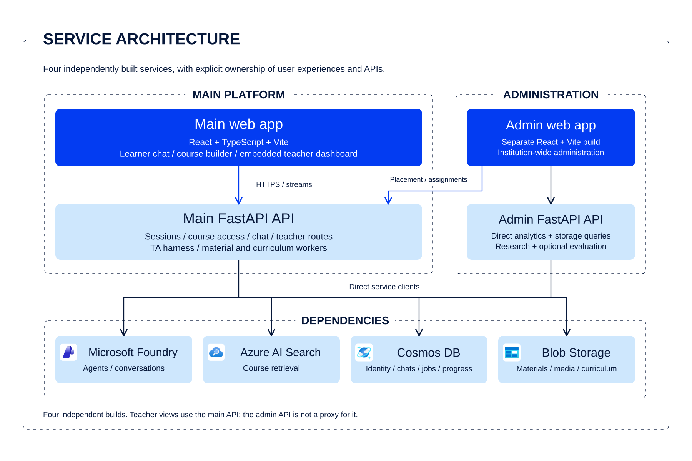
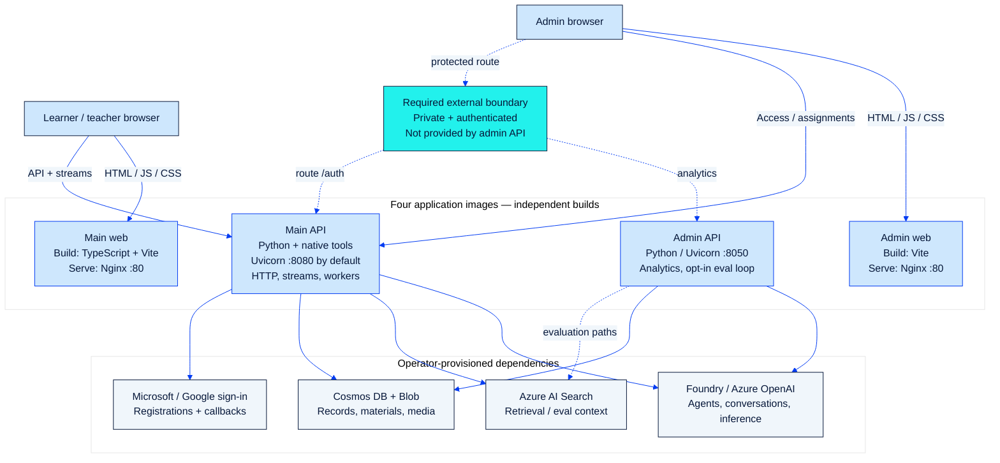

# Deployment

[Documentation index](README.md) · [Conceptual architecture](architecture.md) ·
[Agents and dataflow](agent-dataflow.md)

**Operator guidance for the 2026-09-30 source snapshot; Unreleased.**
This document does not provision resources, enable features, push images, deploy
applications, or update remote agents. Use [INSTALL.md](../INSTALL.md) for local
setup and [release notes](../RELEASE_NOTES.md) for upgrade implications.
For current Azure support versus proposed OpenAI/local/custom adapters, see
[providers and portability](providers.md); provider-neutral packaging is not
part of the current deployment.

For the outstanding Foundry and App Service resources only, see the
[resource setup READMEs](resources/README.md). Their examples reuse completed
dependencies; they do not infer which inventory rows are marked `Mandatory = 1`.

## Deployment units

Use each service directory as its own build context. The main platform directory
is only a grouping; do not turn it into a fifth service or a shared image context.

| Image | Dockerfile and context | In-container process and port |
| --- | --- | --- |
| Main backend | [Platform Backend](<../Agentic Shiksha Platform/Backend/Dockerfile>) | `uvicorn backend.main:app`, `PORT` defaults to 8080 |
| Main frontend | [Platform Frontend](<../Agentic Shiksha Platform/Frontend/Dockerfile>) | Nginx, port 80 |
| Admin backend | [Admin backend](../Admin-Dashboard/backend/Dockerfile) | `uvicorn main:app`, port 8050 |
| Admin frontend | [Admin frontend](../Admin-Dashboard/frontend/Dockerfile) | Nginx, port 80 |

Local development ports are different from image ports: see the
[installation service map](../INSTALL.md#choose-the-services-you-need).
Both API images use Python 3.11. The frontend Dockerfiles currently use
`node:20-alpine` build stages, while local guidance/CI use Node 22; validate the
resolved builder against each lockfile's engine constraints rather than assuming
identical environments or pinned base-image digests.

The main image includes Poppler, TeX, and ngspice for its native features.
Development-machine installations do not prove those features work in an image.

## Engineering view: build artifacts and runtime traffic

This is a **source-derived engineering view, not a live resource inventory**.
Each application box is one independently built image. Cloud dependencies and
the required admin access boundary are outside those images; this guide neither
creates them nor asserts that they have been configured.

[](../assets/web/architecture/index.html#02-shiksha-service-architecture)

The [Agentic Shiksha Architecture Atlas](../assets/web/architecture/index.html) is the
primary architecture artwork. The expanded engineering detail below retains
process ports and the required external access/routing boundary.

<details>
<summary>Port-level traffic and access-boundary detail</summary>



</details>

- **Build is not runtime.** Node runs in the frontend build stages; deployed
  frontends serve static bundles through Nginx. Browser code, not a shared
  Node server, makes API calls. Both Python services install their own
  requirements. The admin Vite build does not include TypeScript checking;
  run that separately as described in [installation checks](../INSTALL.md#verification).
- **Image ports are not development ports.** The diagram uses container ports:
  the main API honors `PORT` (8080 by default), the admin API image uses 8050,
  and both web images use 80. Local development uses 8000 / 5173 / 8050 / 5174;
  publishing two web images requires distinct host ports or routing.
- **Teacher and admin are different paths.** The embedded teacher dashboard
  calls the main API. The standalone admin UI uses its own analytics origin and
  the main API for access/assignment operations. Its development-only `/auth`
  proxy is absent from production Nginx; the dashed authentication route is an
  operator requirement, not routing already implemented by these images.
- **Workers are not extra deployment units.** Main startup/lifespan work and the
  admin's opt-in evaluation loop run inside their API processes. Scaling replicas
  can multiply worker activity. Feature-specific services such as Document
  Intelligence, Speech, and Bing connections are omitted from this overview;
  verify the prerequisites for every enabled feature.
- **Private admin access is mandatory.** Dashed access edges represent required
  external protection/routing, not an existing authentication mechanism.
  The admin API's missing route-level enforcement is not repaired by CORS, a
  frontend login, or this diagram.

## Operator prerequisites

Before any rollout, confirm an authorized target environment and the resources
required by the enabled features:

- Microsoft Foundry project, model deployments, named agent definitions, and
  the intended project connections.
- Cosmos DB and Blob Storage with the expected containers and partition/access
  contracts; Azure AI Search and associated material-processing dependencies.
- Application sign-in registrations, correct callbacks, session-signing
  configuration, and explicit browser/API origins.
- Image registry access, network reachability, least-privilege data-plane roles,
  and an approved way to supply server-only secrets.
- A private, independently authenticated access boundary for the standalone admin
  API, which does not itself provide equivalent route-level user/role enforcement.

These are prerequisites, not a request to create new resources. Do not place real
subscription/resource identifiers, secrets, or learner data in a deployment guide.
Azure service identity is distinct from browser-user authentication.

For Azure App Service custom containers, use Microsoft's
[container configuration guidance](https://learn.microsoft.com/en-us/azure/app-service/configure-custom-container).
Match the platform's routing target to the process's actual port. Classic
custom-container settings and sidecar configuration are not interchangeable;
use the procedure appropriate to the selected hosting mode. Registry image-pull
identity and application data-access permissions must both be verified.

## Configuration boundaries

| Surface | How settings take effect | Required check |
| --- | --- | --- |
| Main backend | Process environment wins over its optional `.env` | Correct feature settings and server secrets before import/startup |
| Admin backend | Process environment wins over its optional `.env` | Configure this independently deployed service directly |
| Main frontend | `VITE_` values compiled at build time | Rebuild when API/auth origins change |
| Admin frontend | Its own compiled `VITE_` values | Distinguish analytics API from main-API placement/assignment calls |
| Foundry agents | Remote agent versions and tool definitions | Review/publish through the separately authorized agent-update path |

For the main frontend, the
[Dockerfile](<../Agentic Shiksha Platform/Frontend/Dockerfile>) also derives the
[Nginx CSP](<../Agentic Shiksha Platform/Frontend/nginx.conf.template>) backend
origin from the `VITE_API_BASE_URL` build argument. Keep real server secrets out
of all frontend inputs and image layers.

The admin frontend has separate
[API-origin settings](../Admin-Dashboard/frontend/src/lib/config.ts) and a
[different Nginx configuration](../Admin-Dashboard/frontend/nginx.conf).
Do not assume it inherits the main site's CSP or response headers. Its Docker
build arguments do not supply every possible `VITE_` setting; verify the final
bundle against the intended main and dashboard APIs.

Routine installation should leave graph memory and periodic admin evaluation
disabled. See [memory](memory/overview.md) and [evaluation](evaluation.md) for
their separate opt-ins. Graph-memory source now includes more than settings and
contracts; that still does not authorize enabling it against existing records.
Its backend switches, course `off`/`shadow`/`authoritative` mode, published binding,
and observation-model configuration are separate prerequisites. Shadow mode
writes evidence and freezes assessments; it is not a no-write dry run. The
frontend reads the server's memory configuration, not a separate Vite opt-in.

## Release procedure

1. **Choose the scope.** Record the source revision, changed services, approved
   environment, compatibility requirements, and responsible operator. Do not
   include unrelated uncommitted work accidentally.
2. **Verify locally.** Run the affected checks in [evaluation](evaluation.md) and
   the [container-build guide](../INSTALL.md#local-container-builds). Validate all
   four services when a change crosses their boundaries.
3. **Build reproducibly.** Use the correct context, lockfiles, builder versions,
   public frontend values, and native dependencies. Inspect images for private
   files and resolve dependency/security findings.
4. **Identify artifacts.** Use immutable image references/digests and record each
   service's artifact separately. Preserve the previous image and private
   configuration through approved operational mechanisms.
5. **Validate the target.** Check resource contracts, credentials/roles, network
   paths, callbacks, cookies, CORS/CSP, and feature flags. Do not use CI dummy
   values for startup or weaken validation to obtain a green health result.
6. **Deploy with approval.** Prefer an isolated staging environment or supported
   deployment slot, then promote using the operator's approved workflow.
   A slot can still run background workers against shared stores; give it
   deliberate data/worker settings before warm-up.
7. **Verify behavior.** Test the checks below with synthetic accounts/materials,
   inspect the actual running digest and logs, and only then accept traffic.
8. **Record the outcome.** Update the
   [release verification record](../RELEASE_NOTES.md#release-verification-record)
   with actual evidence. Documentation edits and local builds stay Unreleased.

Current [CI](../.github/workflows/ci.yml) builds the main service images only;
a successful run is not evidence that the admin images were built. If Docker or
a required integration is unavailable, record that gate as unverified rather
than marking the release ready.

## Azure CLI container and App Service commands

This is the single **PowerShell 7** command recipe for all four services. Use the
service table to select a target instead of maintaining four copies of the same
build/create/identity commands in different READMEs. For initial Foundry, Search,
Storage, Cosmos, Speech, networking, registry and plan creation, see
[Azure resource commands](<../Agentic Shiksha Platform/Backend/azure_services/README.md#azure-resource-creation-commands>).
Local-only Docker builds remain in [INSTALL.md](../INSTALL.md#local-container-builds).

**Read/reference only until the target and operation are approved.** Build uploads
source to ACR and publishes an image; create/update commands change Azure resources.
Select only the intended service, never all four merely because they are listed.
The steps below are for **classic Linux custom-container App Service**, not sidecars.
They are not a complete security/identity/model provisioning script.

### Select one service and immutable release

Run from repository root after selecting the subscription using the
[common context](<../Agentic Shiksha Platform/Backend/azure_services/README.md#common-context>).
`$subscriptionId` and `$resourceGroup` come from that context. Use a verified Git
commit/tag for the build source; uncommitted work is deliberately not packaged.
Reuse an existing plan/registry and confirm names, regions and capacity before writing.

```powershell
$acrName = '<ACR_NAME>'
$planName = '<APP_SERVICE_PLAN_NAME>'
$release = '<NEW_UNIQUE_RELEASE_TAG>' # Not latest; retain the prior tag/digest.
$sourceRef = '<VERIFIED_COMMIT_OR_TAG>'
$serviceKey = 'main-backend' # Change to exactly one approved key below.
$services = @{
  'main-backend' = @{
    context = 'Agentic Shiksha Platform\Backend'
    repository = 'ekalaiva-backend'; app = '<BACKEND_APP_NAME>'; port = 8080
  }
  'main-frontend' = @{
    context = 'Agentic Shiksha Platform\Frontend'
    repository = 'ekalaiva-frontend'; app = '<FRONTEND_APP_NAME>'; port = 80
  }
  'admin-backend' = @{
    context = 'Admin-Dashboard\backend'
    repository = 'ekalaiva-dashboard-backend'; app = '<DASHBOARD_BACKEND_APP_NAME>'; port = 8050
  }
  'admin-frontend' = @{
    context = 'Admin-Dashboard\frontend'
    repository = 'ekalaiva-dashboard-frontend'; app = '<DASHBOARD_FRONTEND_APP_NAME>'; port = 80
  }
}
$service = $services[$serviceKey]
if (-not $service) { throw 'Select one of the four service keys.' }
$appName = $service.app
$registry = az acr show --subscription $subscriptionId `
  --resource-group $resourceGroup --name $acrName --output json | ConvertFrom-Json
if ($LASTEXITCODE -ne 0 -or -not $registry.loginServer) { throw 'Registry lookup failed.' }
$image = "$($registry.loginServer)/$($service.repository):$release"
```

The old `Backend/` and `Frontend/` build contexts from the supplied notes are now
under `Agentic Shiksha Platform\`. The table preserves all four image repositories
without duplicating the commands. Replace the app placeholders only for services
you actually intend to create/update.

### Build and publish through ACR

Both frontend `.dockerignore` files exclude `.env` and `.env.*`. Provide public
browser configuration through the Docker build arguments instead.

This recipe stages the verified service source in a new temporary directory and
passes only explicitly selected **public** browser values. Never copy a real
backend `.env`, OAuth secret, token, private identity mapping or learner record
into the context. Verify the source revision itself is secret-free.

```powershell
$buildRoot = Join-Path ([System.IO.Path]::GetTempPath()) ("shiksha-build-" + [guid]::NewGuid())
$context = Join-Path $buildRoot 'context'
$archive = Join-Path $buildRoot 'source.zip'
New-Item -ItemType Directory -Path $buildRoot | Out-Null
$gitContext = $service.context.Replace('\', '/') # Git tree syntax, not a filesystem path.
git archive --format=zip "--output=$archive" "${sourceRef}:$gitContext"
if ($LASTEXITCODE -ne 0) { throw 'Could not archive the verified service revision.' }
Expand-Archive -LiteralPath $archive -DestinationPath $context -ErrorAction Stop

$buildArguments = @(
  '--subscription', $subscriptionId, '--registry', $acrName,
  '--image', "$($service.repository):$release",
  '--platform', 'linux/amd64', '--file', 'Dockerfile'
)
if ($serviceKey -in @('main-frontend', 'admin-frontend')) {
  $mainApiOrigin = 'https://<MAIN_API_HOST>'
  $dashboardApiOrigin = 'https://<DASHBOARD_API_HOST>'
  $buildArguments += @('--build-arg', "VITE_API_BASE_URL=$mainApiOrigin")
  if ($serviceKey -eq 'main-frontend') {
    $useAgui = '<true_OR_false>'
    if ($useAgui -notin @('true', 'false')) { throw 'Select the approved AG-UI setting.' }
    $buildArguments += @(
      '--build-arg', "VITE_DASHBOARD_API_URL=$dashboardApiOrigin",
      '--build-arg', "VITE_USE_AGUI=$useAgui"
    )
  } else {
    $assignmentsEnabled = '<true_OR_false>'
    if ($assignmentsEnabled -notin @('true', 'false')) { throw 'Select the approved assignment setting.' }
    $buildArguments += @(
      '--build-arg', "VITE_DASHBOARD_API_URL=$dashboardApiOrigin",
      '--build-arg', "VITE_STUDENT_ASSIGNMENTS_ENABLED=$assignmentsEnabled"
    )
  }
}

az acr build @buildArguments $context
if ($LASTEXITCODE -ne 0) { throw 'Image build/publish failed; do not update the app.' }
az acr repository list --name $acrName --subscription $subscriptionId --output table
az acr repository show --name $acrName --subscription $subscriptionId `
  --image "$($service.repository):$release" --query '{image:name,digest:digest}' --output json
```

`az acr build` publishes directly; it does not require a separate Docker push.
Inspect the final frontend bundle for its API/auth origins and feature flags;
the main Nginx CSP must agree with `VITE_API_BASE_URL`. Preserve the release's
approved AG-UI/assignment flags instead of silently accepting Dockerfile defaults.
Enable assignments only after active-admin auth, assignment APIs and credentialed
CORS are verified. Optional legacy
`VITE_AZURE_CLIENT_ID`, `VITE_AZURE_TENANT_ID` and `VITE_AZURE_REDIRECT_URI` are
public compatibility settings, not backend OAuth credentials; provide them only
if a selected client path needs them. Package-mirror build arguments are described
in each Dockerfile; use approved registries and never disable TLS verification.

Keep the recorded digest and previous working image. After build verification,
remove only the newly created temporary `$buildRoot` and its generated archive;
do not clean a workspace or another session's build directory. For another service,
change `$serviceKey` and repeat the selection/build steps with its own verified tag.

### First-time web app creation and ACR identity

**Skip this section for an existing app.** Provisioning identity is not part of an
image-only redeploy. The standalone admin API has incomplete route-level
authorization: establish the approved private/independently authenticated access
boundary before supplying live settings or accepting traffic. Do not expose it as
an unprotected public endpoint simply to test an image.

```powershell
az webapp create --subscription $subscriptionId `
  --resource-group $resourceGroup --plan $planName --name $appName `
  --container-image-name $image
if ($LASTEXITCODE -ne 0) { throw 'Web app creation failed.' }

$principalId = az webapp identity assign --subscription $subscriptionId `
  --resource-group $resourceGroup --name $appName --query principalId --output tsv
if ($LASTEXITCODE -ne 0 -or -not $principalId) { throw 'App identity assignment failed.' }
az role assignment create --subscription $subscriptionId `
  --assignee-object-id $principalId --assignee-principal-type ServicePrincipal `
  --scope $registry.id --role AcrPull --output none
if ($LASTEXITCODE -ne 0) { throw 'AcrPull assignment failed; resolve RBAC before continuing.' }

$registryConfig = [System.IO.Path]::GetTempFileName()
try {
  @{ acrUseManagedIdentityCreds = $true } | ConvertTo-Json |
    Set-Content -LiteralPath $registryConfig -Encoding utf8
  az webapp config set --subscription $subscriptionId `
    --resource-group $resourceGroup --name $appName `
    --generic-configurations "@$registryConfig" --output none
  if ($LASTEXITCODE -ne 0) { throw 'Managed registry authentication configuration failed.' }
} finally {
  Remove-Item -LiteralPath $registryConfig
}
```

Wait for role propagation before judging image-pull health. `AcrPull` above assumes
an RBAC registry; an ABAC-enabled registry needs the corresponding repository data
role. If role assignment returns `AuthorizationFailed`, obtain/activate the
appropriate access. **Do not create a new service principal to bypass the error.**
Registry pull permission does not grant Foundry, Search, Storage or Cosmos access.
An existing user-assigned identity must retain its explicit ACR selection.
Follow Microsoft's [managed-identity container guidance](https://learn.microsoft.com/azure/app-service/configure-custom-container#use-managed-identity-to-pull-an-image-from-azure-container-registry),
including registry ARM-token acceptance and private-registry network requirements.

### Runtime settings, redeploy and verification

Runtime settings are independently configured for each backend. Use an approved
private JSON settings file outside the repository, preferably with secret-manager
references rather than literal credentials. Do not print the returned settings.
For classic container routing, its `WEBSITES_PORT` must match `$service.port` in
the table; the main API process also uses `PORT` (8080 in its Dockerfile).
Ports are not set by `EXPOSE` alone. Frontend public settings must be rebuilt,
not passed to an already running Nginx container.

```powershell
# Only when the runtime-setting change is approved; not needed for every redeploy.
$runtimeSettingsFile = '<PRIVATE_APPSETTINGS_JSON_PATH>'
az webapp config appsettings set --subscription $subscriptionId `
  --resource-group $resourceGroup --name $appName `
  --settings "@$runtimeSettingsFile" --output none
if ($LASTEXITCODE -ne 0) { throw 'Runtime settings update failed.' }
```

For an **existing** app, record its current image/settings/identity first, validate
the new image, and update only the chosen image field. Do not repeat resource
creation or identity assignment. The same selected-target command also restores
an approved previous `$image` during rollback.

```powershell
az webapp config show --subscription $subscriptionId `
  --resource-group $resourceGroup --name $appName `
  --query '{image:linuxFxVersion,alwaysOn:alwaysOn,managedRegistry:acrUseManagedIdentityCreds,registryIdentity:acrUserManagedIdentityID}' `
  --output json
if ($LASTEXITCODE -ne 0) { throw 'Could not read the existing configuration; do not update.' }

az webapp config set --subscription $subscriptionId `
  --resource-group $resourceGroup --name $appName `
  --linux-fx-version "DOCKER|$image" --output none
if ($LASTEXITCODE -ne 0) { throw 'Image update failed.' }
az webapp restart --subscription $subscriptionId --resource-group $resourceGroup --name $appName
if ($LASTEXITCODE -ne 0) { throw 'App restart failed.' }

$site = az webapp show --subscription $subscriptionId `
  --resource-group $resourceGroup --name $appName `
  --query '{host:defaultHostName,state:state}' --output json | ConvertFrom-Json
if ($LASTEXITCODE -ne 0 -or -not $site.host) { throw 'Deployment readback failed.' }
$url = "https://$($site.host)"
$healthPath = switch ($serviceKey) {
  'main-backend' { '/api/health' }
  'admin-backend' { '/api/dashboard/health' }
  default { '/' }
}
Invoke-WebRequest -Uri "$url$healthPath" -TimeoutSec 60
```

Repeat the configuration readback after the update and confirm only the image
changed. A `Running` control-plane state and HTTP 200 are not sufficient:
check the live frontend entry/hash, backend startup/image logs, authenticated
flows and the checks below. Verify retained ACR roles and that out-of-scope apps
were not restarted. A role/configuration error is not a reason to weaken auth.

## Post-deployment checks

| Check | What to verify |
| --- | --- |
| Process health | Main `/api/health` and `/api/healthz`; admin `/api/dashboard/health` |
| Serving configuration | Correct API targets in both bundles, CORS, callbacks, cookies, and main CSP |
| Identity | Sign-in/sign-out, inactive-user rejection, and a denied outside-course request |
| Teaching turn | Start and continue, SSE/AG-UI completion, one visible answer, artifact delivery, and an explicit error path |
| Persistence | Reload a synthetic conversation; distinguish loading failures from empty history |
| Materials | Preflight, persisted job status, indexing readiness, and restart/resume behavior |
| Worker behavior | No unintended evaluation/memory workers; bounded retries and expected shutdown |
| Optional features | Native circuit/rendering smoke tests; approved memory/assessment checks only when enabled |
| Admin isolation | Restriction applies to the API itself, not just browser navigation |

System health routes check liveness, not successful Foundry, Search, Cosmos, Blob,
or identity operations. Verify dependencies separately without logging tokens or
learner content. A timeout or empty reply is not a successful business workflow.

## Scaling, storage, and recovery

Active streams, clarification waits, caches, and some research coordination are
process-local. Before adding replicas, test routing/affinity, concurrent workers,
lease behavior, and reconnects; do not assume another worker can resume an
in-memory wait. Starting a second server can also start another worker loop.

Blob/Cosmos hold durable application state, while local files under `user_data`
include staging/cache/backup content. Container files outside an explicitly
persistent path are not durable across replacement. Confirm uploads/checkpoints
have reached their intended store before deleting or replacing local files.

For rollback, restore the prior verified image and compatible configuration per
service. Reverting an image does not undo database writes, evidence events,
curriculum publication, or remote agent updates. Plan those changes separately;
do not run destructive migration utilities as an installation shortcut.
