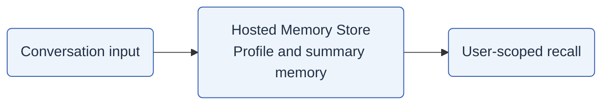

# Learner memory

**Two parts: conversational recall and a custom structure for understanding.**

The **Memory Store** and the project's **custom learner-memory structure** have
different responsibilities. The custom structure is not simply a graph stored
inside the hosted Memory Store.

## What are the two parts?

| | Part 1: Memory Store | Part 2: Custom learner-memory structure |
| --- | --- | --- |
| Main question | What useful context should the agent recall? | What does the evidence say about this learner's understanding? |
| Contents | Extracted profile information and conversation summaries | Curriculum relationships, learner evidence, observations, states, and trajectory |
| Mechanism | Hosted memory processing, scoped updates, and retrieval | Capture evidence, validate interpretations, apply state policy, publish a snapshot/profile |
| Persistence | Foundry-hosted memory store | Separate Cosmos documents and private evidence blobs |
| Authority | Context for a conversation, not a mastery verdict | In authoritative mode, evidence-governed learner state and next-probe recommendations |
| Detailed guide | [Memory Store mechanism](memory-store.md) | [Custom structure and mechanism](overview.md) |

## Part 1: Memory Store

Remember useful conversational context across sessions, when the hosted tool is
configured and attached.

[How the store is created, updated, scoped, and queried](memory-store.md).

## Part 2: Custom learner-memory structure

Connect **concepts**, **misconceptions**, and **evidence** across a **learning
trajectory**. Keep source evidence separate from model interpretation and
policy-derived state.

<a href="overview.md">
  <picture>
    <source media="(prefers-color-scheme: dark)" srcset="../../assets/images/memory/01-connected-memory-graphs-dark.svg">
    
  </picture>
</a>

[Full-size overview](../../assets/images/memory/01-connected-memory-graphs.svg) ·
[Shared misconceptions](../../assets/images/memory/02-curriculum-many-to-many.svg) ·
[Evidence and interpretations](../../assets/images/memory/03-evidence-and-longitudinal-insights.svg) ·
[Download or reuse these images](../../assets/images/memory/README.md)

Its mechanism is **interaction -> evidence -> validated observation -> state
policy -> snapshot/profile -> next teaching step**.
[Read the structure](overview.md#a-shared-map-separate-learner-facts) or
[follow the update mechanism](overview.md#from-an-interaction-to-usable-memory).

## How do the two coexist?

They are two mechanisms in the codebase, **not a promise that both are active
together**. Graph memory is opt-in and disabled by default. Current graph-enabled
agent creation skips the hosted memory tool; authoritative graph turns require
the remote agent to have no hosted memory tool attached.

Legacy topic/progress records remain a compatibility path, not a third new
research component or proof of graph mastery.
[Modes and authority](overview.md#opt-in-configuration-and-modes).

## What can I inspect?

| Guide | Question it answers |
| --- | --- |
| [Memory Store](memory-store.md) | How does conversational context get stored and recalled? |
| [Custom structure and mechanism](overview.md) | What are the nodes, relationships, learner records, and update steps? |
| [Misconception state](misconception-state.md) | What do the state labels mean, and what evidence permits a transition? |
| [Evidence model](evidence-model.md) | How do learner inputs become traceable, scoped, replayable evidence? |
| [See it think](see-it-think.md) | How do an observation, confidence, state, and next teaching move fit together? |

Read these alongside [architecture](../architecture.md),
[EKALAIVA pedagogy](../pedagogy/ekalaiva.md),
[the course Teaching Assistant](../agents/course-ta.md) and
[evaluation](../evaluation.md). Use [INSTALL.md](../../INSTALL.md) for setup and
[deployment](../deployment.md) for operational boundaries; these guides do not
instruct you to enable the optional feature.

Source contracts and documentation boundaries

Source snapshot: **2026-09-30; Unreleased.**

The [typed contracts](<../../Agentic Shiksha Platform/Backend/backend/schemas/learner_memory.py>),
[settings](<../../Agentic Shiksha Platform/Backend/learner_memory/settings.py>) and
[application service](<../../Agentic Shiksha Platform/Backend/learner_memory/service.py>)
anchor the backend description. The [browser feature guide](<../../Agentic Shiksha Platform/Frontend/src/features/memory/README.md>)
and [API adapter](<../../Agentic Shiksha Platform/Frontend/src/lib/learnerMemoryApi.ts>)
cover its server-driven UI opt-in; there is no separate Graph Memory Vite flag.
Older notes and graph-design proposals may lag the working tree. Update these
guides when contracts, producers, UI gates or policies change.

Examples are synthetic. Never add learner records, credentials, private endpoints
or operational identifiers. Linked tests describe validation coverage, not a claim
that those tests or any live service were run for this documentation change.

[Back to documentation](../README.md)
