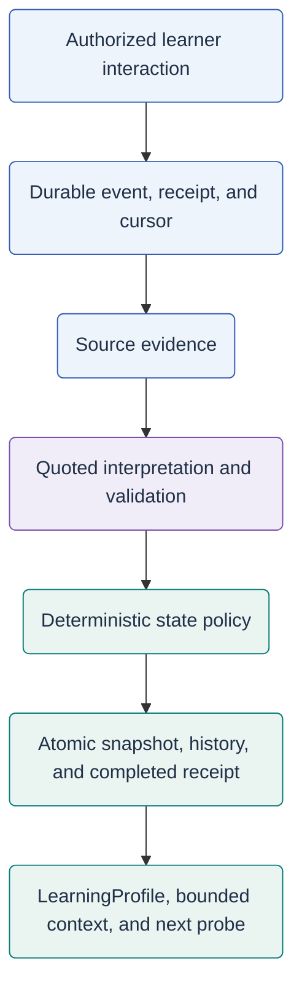

# Learner-memory overview

[Two-part memory README](README.md) / [Part 1: Memory Store](memory-store.md)

**Source snapshot: 2026-09-30; Unreleased.** The local working tree contains an opt-in
graph/evidence pipeline and application integrations, not just a design or schema.
This page does not establish that it is deployed, enabled or operationally complete.

This is **Part 2: the project's custom learner-memory structure and mechanism**,
not a description of the hosted Memory Store. It defines how learning facts are
organized and how evidence changes state; persistence is only one supporting layer.

The research-facing question is **what should the tutor probe next, and on what
evidence?** Learner memory links a reviewed curriculum to a learner's recorded
responses, extracted interpretations, revisable state, and a proposed next probe.
It is not a single mastery score or an agent's hidden reasoning transcript.
[See it think](see-it-think.md) follows one explicitly synthetic example from
learner evidence to a teaching choice, distinguishing existing inspection
surfaces from explanatory illustration.

## Two memory parts and legacy compatibility

| System | What the source stores or retrieves | What it does not establish |
| --- | --- | --- |
| [Part 1: Memory Store](memory-store.md) | A hosted memory-store manager with per-agent stores, scope-based search/update and user-profile/conversation memory support. | Hosted recollections are not the learner graph's assessment ledger or deterministic crossing decision. |
| Part 2: custom learner-memory structure | A reviewed curriculum graph, learner events, evidence, observations, sparse state snapshots and a derived `LearningProfile`. | Code presence, a model's confidence or an earlier legacy `learned` label is not proof of learning or production readiness. |

**Legacy compatibility:** existing per-user/course progress documents retain
topic/concept summaries, `not_started` / `in_progress` / `learned`, and
`misconceptions_addressed`. These are an older progress path, not a third new
research component. A summary saying "addressed" is not evidence-backed `CLEARED`.

Sources: [legacy persistence](<../../Agentic Shiksha Platform/Backend/azure_services/persistence/cosmos_db.py>),
[legacy progress tool](<../../Agentic Shiksha Platform/Backend/agent_tools/custom/update_topic_progress/__init__.py>),
[hosted memory manager](<../../Agentic Shiksha Platform/Backend/azure_services/tools/memory/memory_store_manager.py>)
and [learner-memory service](<../../Agentic Shiksha Platform/Backend/learner_memory/service.py>).
The hosted manager's `{{$userId}}` scope expression is a configuration mechanism,
not evidence that every remote agent resolves it to an isolated learner identity.

## A shared map, separate learner facts

The graph is curriculum data, not a graph inferred freely from learner chat.
Its exact node types are `COURSE`, `TC`, `MISCONCEPTION`, `CONCEPT_INVENTORY`,
`PROBLEM` and `CURRICULUM_VERSION`; `TC` means threshold concept.

| Directed relationship | Meaning |
| --- | --- |
| `COURSE -HAS_THRESHOLD-> TC` | The course contains a threshold concept. |
| `TC -PREREQUISITE_OF-> TC` | The source is a prerequisite of the target; numbering is irrelevant. |
| `MISCONCEPTION -ASSOCIATED_WITH-> TC` | A misconception matters to this concept. |
| `TC -ASSESSED_BY-> CONCEPT_INVENTORY -CONTAINS-> PROBLEM` | An inventory groups assessment tasks. |
| `TC -HAS_PROBLEM-> PROBLEM`; `PROBLEM -TESTS-> TC` | Practice and assessment links have distinct roles. |
| `PROBLEM -DIAGNOSES-> MISCONCEPTION` | A reviewed mapping specifies diagnostic outcome semantics. |
| `TC -HAS_TRANSFER_PROBE-> PROBLEM` | A task tests transfer, optionally under a named condition. |

`required_for_crossing` on misconception/transfer edges is the crossing switch.
`threshold_relevance` (`BLOCKING`, `SIGNIFICANT`, `PERIPHERAL`) and pedagogical
priority do not silently make an optional edge required.
[Graph validation](<../../Agentic Shiksha Platform/Backend/learner_memory/curriculum.py>)
checks endpoint types, duplicates, version bindings and prerequisite cycles.
Publishing additionally needs teacher-reviewed policies, a nonempty required
misconception set for every active TC, sufficient reviewed clearing-task families,
and reviewed transfer requirements. Published versions are immutable.

Graphs have explicit institute/course grants. A learner `MemoryScope` pins
`tenant_id`, `institute_id`, `course_id`, `student_id`, `curriculum_id`,
`curriculum_version` and `learning_epoch`. Shared definitions do not mean shared
learner state. Storage is Cosmos document-based; this implementation does not
require a separate graph database.

### Structure versus persistence

| Custom structure | Role | Persistence |
| --- | --- | --- |
| Reviewed curriculum graph | Shared concept, misconception, inventory, problem, prerequisite, and version definitions | Versioned Cosmos graph documents |
| Learner evidence and state | Learner-scoped events, evidence, interpretations, transition history, and snapshots | Cosmos learner records, with private Blob evidence artifacts |
| Derived learning profile | A bounded view of current state, gaps, trend, and next probe | Derived from the committed snapshot, not a separate authority |

The structure is the project's learning model. Cosmos and Blob are storage
adapters; the hosted Memory Store is a different conversational-memory mechanism.

## From an interaction to usable memory

[Events](<../../Agentic Shiksha Platform/Backend/learner_memory/events.py>) preserve
input before processing. The [extractor](<../../Agentic Shiksha Platform/Backend/learner_memory/observations.py>)
can propose interpretations, not state writes or new curriculum nodes.
The [processor](<../../Agentic Shiksha Platform/Backend/learner_memory/processor.py>)
publishes only a complete reduction. A pending receipt does not mean a new
snapshot exists; reads expose a snapshot version, freshness and pending count.

The [LearningProfile](<../../Agentic Shiksha Platform/Backend/learner_memory/profile.py>)
projects active/strong/weak/candidate/crossed TCs, active misconceptions,
prerequisite gaps, trend and a next probe from accepted state. It is a projection,
not an additional independent authority. Unassessed prerequisites invite a diagnostic; they are not
automatically labelled `STRUGGLING`. See [state semantics](misconception-state.md)
and [evidence processing](evidence-model.md).

Keep three signals distinct: **extraction confidence** describes an observation
and is uncalibrated; **state and trend** summarize the retained evidence under
policy; **the next probe** is a recommendation, not another learning result.
The backend returns target/problem IDs and a reason code. A tutor's proposed
teaching strategy interprets that recommendation; it cannot write mastery,
clearance, or crossing into existence.

## Opt-in configuration and modes

[MemorySettings](<../../Agentic Shiksha Platform/Backend/learner_memory/settings.py>)
reads the process environment with prefix `GRAPH_MEMORY_`, no dotenv discovery,
and a cached settings instance. Canonical environment names are:

| Setting | Source default | Meaning |
| --- | --- | --- |
| `GRAPH_MEMORY_ENABLED` | `false` | Enables graph-memory application paths. |
| `GRAPH_MEMORY_WORKER_ENABLED` | `false` | Separately enables processing; invalid if memory itself is disabled. |
| `GRAPH_MEMORY_OBSERVATION_MODEL` | Unset | Explicit extraction deployment; ordinary learner extraction fails if absent. |
| `GRAPH_MEMORY_GRAPH_CONTAINER` | `curriculum_graph_v1` | Shared graph Cosmos container. |
| `GRAPH_MEMORY_LEARNER_CONTAINER` | `learner_memory_v1` | Learner ledger/snapshot Cosmos container. |
| `GRAPH_MEMORY_EVIDENCE_CONTAINER` | `learner-evidence-v1` | Private evidence Blob container. |

Constructor/read aliases such as `graph_container_name` do **not** create
`GRAPH_MEMORY_GRAPH_CONTAINER_NAME` environment variables. Use the settings source
for the full contract and limits.

The course document's `graph_memory_mode` is separate from environment settings:

- `off`: legacy behavior; no course graph-memory capture.
- `shadow`: captures/processes graph evidence without switching progress-tool,
  TA-context or teacher-insight authority away from legacy behavior. It is **not**
  a no-write dry run: server-frozen assessment handling also applies.
- `authoritative`: graph context becomes the learning-state authority. Legacy
  progress mutations are rejected and compatibility reads project graph state.

[Configuration routes](<../../Agentic Shiksha Platform/Backend/backend/routers/learner_memory.py>)
require a scoped administrator, a reviewed scope registry and a published binding.
Publication and activation are separate operations. Authoritative activation/chat
also verifies that the selected hosted agent has no memory tool and pins the
verified version; it does not silently edit the remote definition.

### Browser opt-in is server-driven

[useMemoryConfig](<../../Agentic Shiksha Platform/Frontend/src/features/memory/useMemoryConfig.ts>)
reads `/api/agents/{agentId}/memory/config`; the
[API adapter](<../../Agentic Shiksha Platform/Frontend/src/lib/learnerMemoryApi.ts>)
maps server `graph_memory_mode` to `MemoryConfig.mode`. Memory panels require
`config.enabled && config.mode !== "off"`; authoritative presentation additionally
requires `config.mode === "authoritative"`. There is no separate Graph Memory
Vite flag. Optional `can_manage === true` exposes administrator configuration
controls, not authorization; the server still verifies every operation.

The client uses [VITE_API_BASE_URL](<../../Agentic Shiksha Platform/Frontend/src/lib/config.ts>)
for the main API with session credentials and `cache: "no-store"`, not the
standalone admin API. `VITE_USE_AGUI` selects chat transport only; neither variable
enables Graph Memory. UI configuration lookup alone does not start a worker.

## Application wiring found in source

| Entry point | Current connection |
| --- | --- |
| [API lifespan](<../../Agentic Shiksha Platform/Backend/backend/main.py>) | Constructs/validates the memory repository only when enabled; starts the asynchronous worker only with the worker flag. |
| [Chat router](<../../Agentic Shiksha Platform/Backend/backend/routers/chat.py>) and [harness](<../../Agentic Shiksha Platform/Backend/harness/runtime.py>) | SSE, AG-UI and nonstream adapters capture a stable learner event before opening generation; authoritative turns inject bounded graph context. |
| [Integration bridge](<../../Agentic Shiksha Platform/Backend/learner_memory/integration.py>) | Server-owned tool context prevents model arguments changing learner scope; conversation metadata binds scope, curriculum and epoch. |
| [Threshold tool](<../../Agentic Shiksha Platform/Backend/agent_tools/custom/get_threshold_concepts/__init__.py>) / [progress tool](<../../Agentic Shiksha Platform/Backend/agent_tools/custom/update_topic_progress/__init__.py>) | Authoritative reads return graph context; progress proposals return `read_only`, not mastery/crossing writes. |
| [Quiz tool](<../../Agentic Shiksha Platform/Backend/agent_tools/custom/add_quiz/__init__.py>) / [assessment router](<../../Agentic Shiksha Platform/Backend/backend/routers/assessments.py>) | Freeze server assessment identity/keys, grade the immutable first submission, then mirror feedback into the existing quiz-asset surface. |
| [Teacher insights](<../../Agentic Shiksha Platform/Backend/teacher_dashboard/routes.py>) / [analytics tools](<../../Agentic Shiksha Platform/Backend/teacher_dashboard/logging_agent_tools.py>) | Authoritative insights use scoped individual context or cohort summaries; graph tools refresh membership authorization. |
| [ChatView](<../../Agentic Shiksha Platform/Frontend/src/pages/ChatView.tsx>) / [learner profile](<../../Agentic Shiksha Platform/Frontend/src/components/chat/LearnerProfileDialog.tsx>) / [teacher dashboard](<../../Agentic Shiksha Platform/Frontend/src/features/dashboard/TeacherDashboardPage.tsx>) | Existing screens host enabled graph views in both shadow and authoritative modes; only authoritative replaces the legacy profile overview. Teacher selection uses the supplied course roster. |
| [GraphMemoryPanel](<../../Agentic Shiksha Platform/Frontend/src/features/memory/GraphMemoryPanel.tsx>) | Shows snapshot/pending/freshness and mastery versus crossing; labelled experimental in shadow. Pending reads refresh after five seconds, matching `learner-memory-updated` events refresh the view, and citations fetch evidence on demand. Cohort output marks partial coverage. |
| [CurriculumGraphEditor](<../../Agentic Shiksha Platform/Frontend/src/features/memory/CurriculumGraphEditor.tsx>) | Non-student graph editing plus local validation. **Save graph draft**, **Publish reviewed graph** and **Save course configuration** are separate explicit writes with revision checks; publication requires a saved unchanged draft and an event/idempotency key. Publishing does not activate the binding. |

Memory routes also expose state, context, evidence, receipts, reset/recompute and
cohorts. This inventory is **production-source wiring**, not a live-service audit.
The browser feature is embedded in these screens, not a standalone page. Opening
the editor does not save/publish, and the general TA **Update** button does not
commit its changes.

## Boundaries, privacy and remaining limits

- [Access resolution](<../../Agentic Shiksha Platform/Backend/backend/dependencies/learner_access.py>)
  uses active accounts, explicit course enrollment/teacher assignment and scoped
  administrator grants. A role name or a chat history is not enrollment.
- Cohort retrieval aggregates snapshots without loading raw evidence. Individual
  context may contain sensitive learner quotations. Opaque IDs are not anonymity.
- Missing evidence is not failure; confidence values are explicitly uncalibrated.
  `MASTERED` and `CROSSED` answer different questions, not interchangeable grades.
- Legacy curriculum import produces a draft; historical evidence import does not
  promote old `learned` claims into crossings. These are not automatic migrations.
- Reset opens a new learning epoch while retaining history; it is not erasure.
  The Blob adapter provides private artifact operations, not automatic offloading
  of every event. Raw answers/reasoning can remain in Cosmos records.
- Contract values for assignments, reflections and simulations do not prove every
  activity producer is integrated. `NO_RECORDED_HINT` does not prove no help was
  received. Reviewed tasks, policy calibration and operational recovery still need
  deliberate validation; no universal learning-outcome guarantee is established.

Representative source checks live in
[integration tests](<../../Agentic Shiksha Platform/Backend/tests/test_graph_memory_integration.py>),
[access tests](<../../Agentic Shiksha Platform/Backend/tests/test_graph_memory_access.py>) and
[retrieval tests](<../../Agentic Shiksha Platform/Backend/tests/test_graph_memory_retrieval.py>).
They were not executed for these documentation-only changes.

Continue with [architecture](../architecture.md), [pedagogy](../pedagogy/ekalaiva.md),
[the course Teaching Assistant](../agents/course-ta.md), [evaluation](../evaluation.md),
[deployment](../deployment.md) and [installation](../../INSTALL.md).
