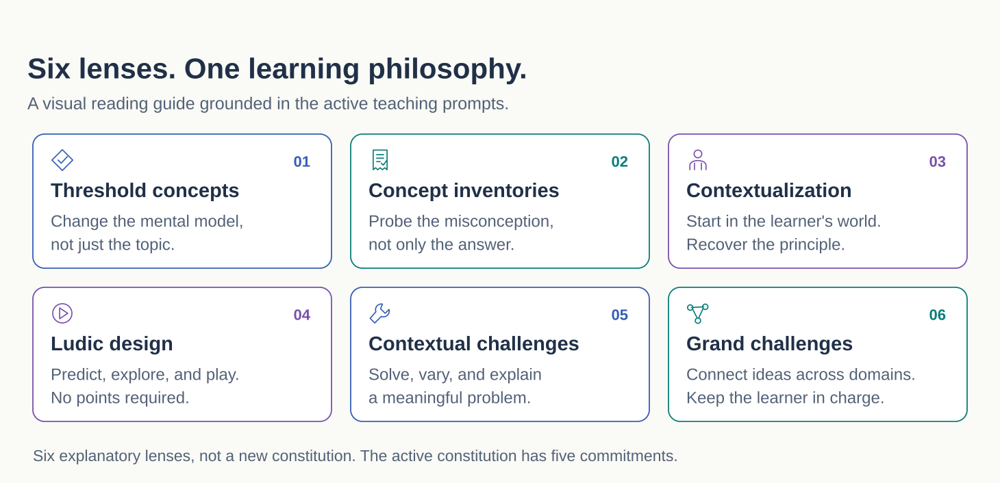

# EKALAIVA / Pedagogy

**From covering content to changing how a learner thinks.**

The [full Ekalaiva guide](ekalaiva.md) introduces Swami Manohar's broader framework,
provides a [reading map](ekalaiva.md#manohars-framework-and-blog-series) and
[seven blog citations](ekalaiva.md#references-manohars-blog-series), then connects
the vision to Agentic Shiksha's teaching cycle, local prompts, and implementation.

These cards illustrate the repository's pedagogical ideas; they do not enumerate
the author's six framework pillars. Pedagogical intent is not evidence of learning improvement.

## Where does the pedagogy meet the code?

- [Curriculum research agents](../agents/curriculum-research.md): textbook and threshold-concept research.
- [Course creation](../agents/course-creation.md): CACA specification and TA provisioning.
- [Course Teaching Assistant](../agents/course-ta.md): learner-facing execution.
- [Implemented-agent catalogue](../agents/README.md): actual identifiers and call sites.
- [Memory overview](../memory/overview.md): enabled modes and authoritative state.
- [Evaluation](../evaluation.md): engineering checks and pedagogical validation.
- [Architecture](../architecture.md): service boundaries and data flows.

[Back to the research guide](../README.md)
