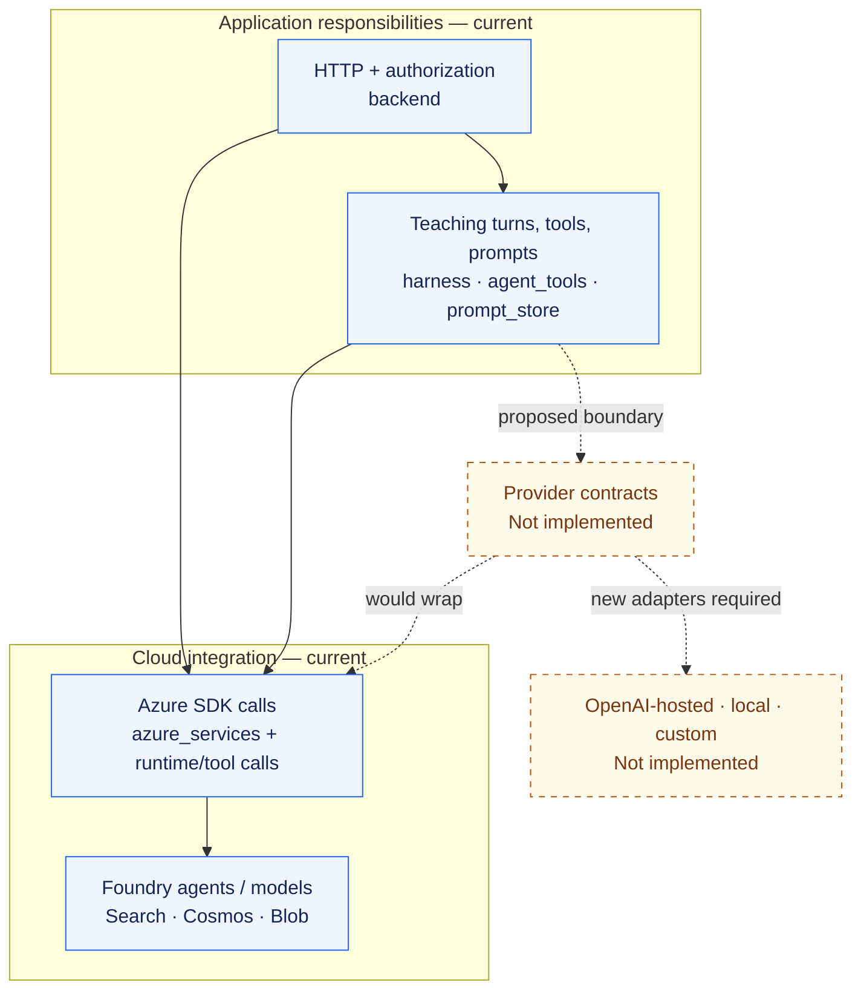

# Providers and portability

[Documentation index](README.md) · [Conceptual architecture](architecture.md) ·
[Agents and dataflow](agent-dataflow.md) · [Deployment](deployment.md)

**Source snapshot: 2026-09-30; Unreleased.** This guide distinguishes the
implemented cloud path from a possible provider-neutral design. It does not
claim a deployment, a working credential set, or compatibility with every model
available from a provider.

> **Today:** the application is wired to Microsoft Foundry and Azure services.
> OpenAI-hosted, local-inference, and arbitrary custom-provider backends are
> extension targets, **not selectable application providers** in this checkout.

## Provider choice: what is implemented

| Option | Current status | What the code establishes |
| --- | --- | --- |
| Microsoft Foundry / Azure OpenAI | **Implemented integration path; configured resources required** | The [teaching runtime](<../Agentic Shiksha Platform/Backend/harness/runtime.py>) constructs `AIProjectClient`, obtains its OpenAI-compatible client, and separately constructs `openai.AzureOpenAI` for inference. [Agent creation](<../Agentic Shiksha Platform/Backend/azure_services/agents/agent_creation.py>) creates named, versioned Foundry agents. |
| OpenAI-hosted API | **Not wired as an application provider** | The `openai` dependency is used by the Azure path. It is not evidence of an `api.openai.com` runtime, a provider selector, or an application-wide `OPENAI_API_KEY` setup. Replacing an endpoint alone does not replace Foundry agent/conversation semantics. |
| Local inference | **Not wired as an application provider** | There is no application adapter for an Ollama, vLLM, or other local inference server. Running Uvicorn and Vite locally still uses the configured cloud integrations. Local rendering/native tools and synthetic test responses are not local LLM inference. |
| Custom provider / arbitrary compatible endpoint | **Requires implementation work** | There is no general provider registry or interchangeable model-client contract. Custom tools extend the teaching agent's capabilities, not its model host. Individual endpoint settings do not constitute an end-to-end provider adapter. |

Model choice **within the implemented Azure path** is configuration, not provider
portability. The [configuration module](<../Agentic Shiksha Platform/Backend/azure_services/config.py>)
requires `AZURE_OPENAI_CHAT_MODEL`, `EMBEDDING_MODEL`, `EMBEDDING_DIMENSIONS`, and
`AZURE_EVAL_MODEL`, together with project, Search, and storage settings.
Use provisioned deployments compatible with the relevant API and tools. Changing
a local setting does not itself republish an existing remote agent version.
Some features have their own model/endpoint settings; one chat-model setting
does not switch all inference, embeddings, images, research, and evaluation.

### Why the dependency names can be misleading

- The main and admin manifests both pin `openai` alongside `azure-ai-projects`.
  The [admin logging agent](../Admin-Dashboard/backend/admin_backend/integrations/logging_agent_chat.py)
  also uses `AIProjectClient.get_openai_client()`, not an independent
  OpenAI-hosted backend.
- The main manifest includes `litellm`, but the
  [PDF converter](<../Agentic Shiksha Platform/Backend/utils/markdown_converter.py>)
  calls it with `model="azure/..."`, an Azure endpoint/API version, and an
  Azure AD token. The library's wider provider catalog is not exposed as an
  application capability.
- The [image tool](<../Agentic Shiksha Platform/Backend/agent_tools/custom/generate_image/__init__.py>)
  constructs `openai.OpenAI(base_url=...)`. Its `AZURE_IMAGE_ENDPOINT` override
  falls back to `AZURE_FOUNDRY_ENDPOINT`, uses the `/openai/v1` surface and an
  Azure bearer token, and persists images through Azure Blob Storage.
  This is a feature-specific Azure client, not a custom-provider switch.
- [Azure service credentials](<../Agentic Shiksha Platform/Backend/common_azure_auth.py>)
  and browser-user sign-in are separate concerns. Neither a generic API key nor
  an authenticated browser replaces the required Azure data-plane permissions.

Dependency evidence: [main API requirements](<../Agentic Shiksha Platform/Backend/requirements.txt>)
and [admin API requirements](../Admin-Dashboard/backend/requirements.txt).

## Core and cloud responsibilities

The separation below is a **responsibility map**, not a claim that the current
backend has a provider-neutral core package. Solid arrows show current coupling;
dashed arrows describe a future substitution boundary.



Prompts, tool schemas, domain policy, and event contracts are candidates for
reuse. They are not proof that the enclosing runtime is cloud-independent:
`harness/runtime.py` creates cloud clients directly, and cloud calls also exist
outside `azure_services`. Switching a model alone would leave retrieval,
persistence, identity, hosted agent state, and feature tools to address.

For the separate **four-service build/runtime topology**, see
[deployment](deployment.md#engineering-view-build-artifacts-and-runtime-traffic).
Provider adapters would not automatically become additional deployed services.

## Actual directories versus a proposed layout

### Present in this checkout

The main services share a parent folder, not a Python environment or build
context. Selected current paths are:

```text
Agentic Shiksha Platform\
  Backend\
    backend\                  app.py, main.py, dependencies\, routers\, schemas\
    harness\runtime.py        canonical teaching runtime; Azure-wired
    base_agents\general_agent.py
                              compatibility alias, not another provider
    agent_tools\              tool implementations and schemas
    prompt_store\             versioned instructions
    azure_services\           agents, persistence, Search and other integrations
    learner_memory\           learner-memory implementation
    utils\                    workflows and supporting utilities
    common_azure_auth.py       Azure credential helpers
    requirements.txt          this API's dependencies
  Frontend\                   independent React/Vite client and package.json
Admin-Dashboard\
  backend\                    independent API, admin_backend\ package, own dependencies
  frontend\                   independent React/Vite client and package.json
```

[Application assembly](<../Agentic Shiksha Platform/Backend/backend/app.py>) can
accept an injected router/origin configuration for isolated tests. The production
entry remains `backend.main:app` and loads its real registry/lifespan. This
testability seam is not an offline application mode or a provider adapter.

### Proposed core/providers design — not implemented

The following is an **illustrative portability design only**. These `core` and
`providers` directories are not the current layout, not installable packages,
and not a promise that the listed adapters exist.

```text
Backend\
  core\                       proposed contracts, teaching policy, internal events
  providers\
    azure\                    proposed encapsulation of existing Azure integrations
    openai\                   not implemented
    local\                    not implemented
    custom\                   not implemented
  backend\                    HTTP boundary and explicit implementation wiring
```

The [refactoring plan](../refactoring_plan.md#3-target-repository-layout) remains
the reference for staged restructuring. Its intended owners include
`backend\core`, `services`, `runtime`, `integrations`, and `protocols`; the sketch
above illustrates responsibilities rather than replacing that plan's names or
authorizing a second, parallel implementation. Create no empty adapter folders
solely to make this diagram look complete. A shared root library would also need
an explicit packaging/build-context design before independent services could
consume it.

A real portability change would need to:

1. Define model/agent contracts for conversations, tool calls, streaming events,
   cancellation, errors, and capability differences, without leaking SDK types
   into the reusable teaching policy.
2. Encapsulate the existing Azure calls, including calls inside the harness and
   feature tools, without changing current auth, course scope, or persistence.
3. State which non-model dependencies remain Azure-backed. A different inference
   endpoint does not provide Foundry agent versions, Search indexes, Cosmos
   records, Blob assets, or the existing memory/evaluation contracts.
4. Implement and test each alternative explicitly. Preserve deny/error behavior,
   use synthetic fixtures, and never silently fail over to another provider or
   remove authentication to make a demo start.

Those are acceptance considerations for future work, not completed features.

## Shortest honest start

### No cloud setup: view the recorded synthetic experience

From the repository root in **PowerShell**, open the local recorded-demo gallery:

```powershell
Start-Process '.\web\motion\index.html'
```

This needs a browser, not API credentials or dependency installation. The
[tutorial gallery](../assets/web/motion/index.html) contains recordings of the actual
React UI using synthetic identities, responses, and state. It is **not live
inference**, an end-to-end cloud test, or a public hosted demo. The
[research gallery](../assets/web/research/index.html) contains explanatory figures.
Regeneration has additional prerequisites in the [media guide](../assets/images/README.md).
For the snapshot's verified public links and evidence limits, see the
[research guide](research.md).

### Run the actual application

Use [INSTALL.md](../INSTALL.md), not a three-command provider-switch recipe.
The minimum teaching setup is the **main API plus main frontend** in separate
terminals; the standalone admin pair is optional for that workflow.

- Use Python 3.11 with a service-local virtual environment and Node 22.12+ in the
  Node 22 line. Install each service's own manifest; there is no root install.
- Configure authorized Foundry, Search, Cosmos, Blob, feature resources, and
  server-side sign-in/session settings before starting the main API. Its
  configuration fails on missing required values; its lifespan starts
  cloud-backed work. Synthetic test settings are not runtime credentials.
- From `Agentic Shiksha Platform\Backend`, the entry point is
  `uvicorn backend.main:app` with `PYTHONPATH` set to that service root; use the
  [full backend startup command](../INSTALL.md#main-backend).
- From `Agentic Shiksha Platform\Frontend`, use the
  [frontend setup](../INSTALL.md#main-frontend). Public `VITE_API_BASE_URL` and
  `VITE_API_URL` must target the intended main API/auth origin. `VITE_` values
  never hold server secrets.
- Leave experimental graph memory and periodic admin evaluation disabled for
  routine installation. The standalone admin API requires an independently
  authenticated private access boundary; CORS or a logged-in UI is not that
  boundary. Keep the [deployment warnings](deployment.md) in force.

Local hosting is not local inference. Dependency installation, a health response,
or an isolated browser test does not establish provider compatibility or cloud
readiness.
